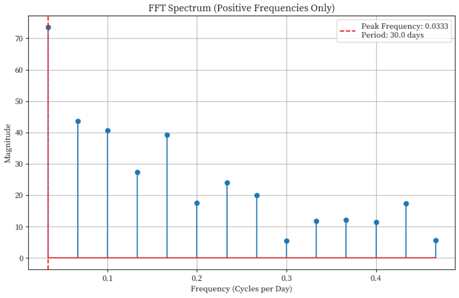
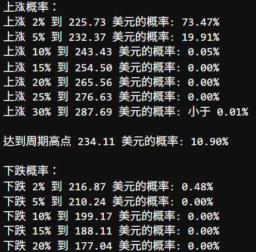
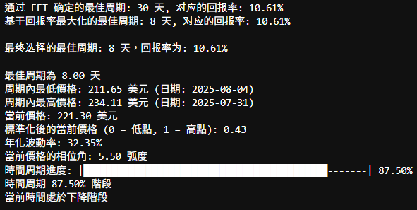

# FFT + Probabilistic Stock Demo

This project demonstrates a **cycle-centric** workflow for probabilistic stock forecasting:
we first use **FFT** to detect the dominant cycle and choose a **stable observation window**,
then estimate **probabilities of up/down X%** and **probability to reach the cycle high**
with **four distribution engines** (Price-Normal, Log-Normal, Student’s *t*, Historical Simulation).
Finally, a **rolling backtest** automatically selects the best-performing engine.

> This is a **public demo repository** — the full code and pipelines remain **private**.  
> For collaboration or access requests, please contact me.

---

## Features

- **FFT cycle detection**: de-mean → FFT → pick peak frequency → convert to **period (days)**
- **Best observation window X**: scan windows and pick the one whose dominant period is most **stable** (closest to an integer)
- **Return-driven period**: inside a candidate range, choose the period that maximizes \((\max - \min)/\min\)
- **Phase progress**: anchor at the most recent low; compute in-cycle time progress and phase angle
- **Four probability engines**:  
  0) **Price-Normal**, 1) **Log-Normal**, 2) **Student’s t** (fat tails), 3) **Historical Simulation** (non-parametric)
- **Automatic model selection**: multi-threshold **Brier Score** with **rolling backtest**
- **Indicator vote (demo)**: MA / RSI / Bollinger / OBV for contextual tags
- **Outputs**: trendlines, FFT spectrum, probability curves & tables (see `output/`)

---

##  Pipeline

1. Download market data (e.g., Yahoo Finance)  
2. Preprocess (de-meaned series, indicators, **daily log-returns**)  
3. **FFT** → dominant period & **best observation window X**  
4. **Return-driven** period selection (maximize amplitude return in candidate set)  
5. **Phase progress**: locate today within the cycle  
6. **Four probability engines** for the terminal price \(S_T\)  
7. **Rolling backtest** (multi-threshold events, Brier Score) → **select best engine**  
8. Produce **probabilities for up/down X%** and **probability to reach the high**, with composite plots

**Text-only flow (pasteable):**

```

                                          [Tickers / Data]
                                                 │
                                                 ▼
                                     [Preprocess & Indicators]
                                                 │
                                                 ▼
                                     [FFT (Frequency → Period)]
                                                 │
                                                 ▼
                                    [Best Observation Window X]
                                                 │
                                                 ▼
                                      [Return-Driven Period]
                                                 │
                                                 ▼
                                         [Phase Progress]
                                                 │
                                                 ▼
              [Probability Engines: Price-Normal | Log-Normal | Student t | Historical]
                                                 │
                                                 ▼
                              [Rolling Backtest → Find the Best Model]
                                                 │
                                                 ▼
                            [Probabilities: Up/Down x% & Reach High]

```


---

## 📊 Demo Outputs (examples)

- FFT spectrum & dominant period: `output/fft_spectrum.png`  
  

- Up/Down probability printout: `output/probabilities_example.png`  
  

- Cycle metrics & phase progress: `output/phase_progress.png`  
  
---

##  Math Notes (Core Formulas)

### 1) FFT Dominant Period (Frequency → Period)
Apply DFT to the **de-meaned** price series `x_t - x̄`, keep **positive frequencies**, and pick the peak frequency `f̂`.  
The dominant **period** (trading days per cycle):

```
P̂ = 1 / f̂
```

### 2) Best Observation Window (X)
Scan `X ∈ [30, 200]` (configurable step). For each window, run FFT to obtain `P̂_X`.  
Define **stability** by proximity of `P̂_X` to an integer:

```
frac = P̂_X - ⌊P̂_X⌋

stability(X) = {
    +∞,                           if frac = 0
    1 / min(frac, 1 - frac),     otherwise
}
```

Pick `X` with the largest stability.

### 3) Return-Driven Period (within candidates)
For each candidate `P` (e.g., 15–45 days), take the most recent `P` days:

```
Return(P) = (max(S) - min(S)) / min(S) × 100%
```

Choose the `P` that maximizes `Return(P)`.

### 4) Phase Progress (Time within the cycle)
Using the **most recent local low** within the latest period window as a phase anchor:

```
progress = (days_since_last_low mod P) / P
θ = 2π × progress
```

where `θ` is the phase angle and `progress ∈ [0,1)` is the cycle time progress.

### 5) Annualized Volatility → H-Day Horizon
With annualized volatility `σ_ann` from **daily log-returns**, scale to `H` days:

```
σ_H = σ_ann × √(H / 252)
```

where **252** ≈ trading days per year.

### 6) Probability Engines (for terminal price S_T)

**(0) Price-Normal (simplified):** assume `S_T ~ N(μ_S, σ_S)`,

```
μ_S = S_0 × (1 + ER)
σ_S = S_0 × σ_ann × √(H / 252)
```

Then:
- `K ≥ S_0`: `P(S_T ≥ K) = 1 - Φ((K - μ_S) / σ_S)`
- `K ≤ S_0`: `P(S_T ≤ K) = Φ((K - μ_S) / σ_S)`

**(1) Log-Normal (normal log-returns — recommended):** let `r = ln(S_T/S_0) ~ N(μ_r, σ_r)`,  
`σ_r = σ_ann × √(H / 252)`, `μ_r ≈ ln(1 + ER)`. Then:

```
P(S_T ≥ K) = 1 - Φ((ln(K/S_0) - μ_r) / σ_r)
P(S_T ≤ K) = Φ((ln(K/S_0) - μ_r) / σ_r)
```

**(2) Student's t (log-returns, fat tails):** `r = ln(S_T/S_0) ~ t_ν(μ_r, σ_r)`.  
Replace `Φ` by the Student-t CDF for better tail behavior.

**(3) Historical Simulation (non-parametric):** use past **H-day log-return** samples in a long window (e.g., 3 years) to form the empirical distribution:

```
P̂(S_T ≥ K) = (1/N) × Σ[i=1 to N] 𝟙{r_i ≥ ln(K/S_0)}
```

> **ER (Expected Return)** can be set heuristically from **remaining upside × remaining time in the cycle**; log-models use `μ_r = ln(1 + ER)` for consistency.

### 7) Event Probabilities (Up/Down x%, Reach Cycle High)
- Up `x%`: set `K = S_0 × (1 + x)` → compute `P(S_T ≥ K)`  
- Down `x%`: set `K = S_0 × (1 - x)` → compute `P(S_T ≤ K)`  
- Reach cycle high: set `K = cycle_high`

### 8) Model Selection (Rolling Backtest + Brier Score)
For each evaluation date `t`, with horizon `H` and thresholds `x ∈ {2%, 5%, 10%}`, compare predicted probabilities `p_t` vs. realized binary outcomes `y_t`:

```
Brier = (1/n) × Σ[i=1 to n] (p_i - y_i)²   
```

---

##  Repository Structure


```
Repo
├─ output/
│ ├─ fft_spectrum.png
│ ├─ probabilities_example.png
│ ├─ phase_progress.png
└─ README.md

```

---
Contact
For full implementation or custom adaptations:

Kai Yeh

📧 Email: KaiYeh820206@gmail.com
💻 GitHub: WayneKaiYeh
---
📄 License
https://licensebuttons.net/l/by-nc-nd/4.0/

Allowed: Personal/educational use with attribution

Prohibited: Commercial use or redistribution

No Derivatives: Modified versions not permitted

Full license terms: Creative Commons BY-NC-ND 4.0
